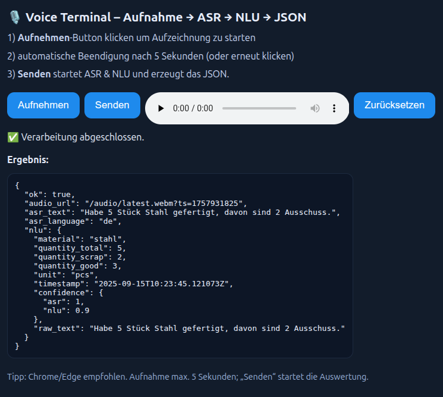

# Voice Terminal – Aufnahme → ASR → NLU → JSON

Lokale Weboberfläche: Aufnahme (max. 5s) → Upload → **Senden** startet ASR (Whisper via faster-whisper) und einfache NLU (Regex).
Ergebnis erscheint im Browser und als Datei.



## Benutzung

Im Projektverzeichnis ein Terminal starten. Der folgende Befehl erstellt den Container:

```bash
docker compose build
```
Dies kann beim ersten Build ungefähr 5 Minuten dauern. Sobald das Docker-Image fertig gebaut wurde, kann der Container gesartet werden mit:

```bash
docker compose up
```

Dadurch wird ein Webserver mit dem Frontend gestartet, das im Browser über folgende URL erreichbar ist:

```
http://localhost:8000
```

Beim ersten Aufruf wird vom Browser nach der Berechtigung zur Nutzung des Mikrofons gefragt, welche für die Sprachaufzeichnung erforderlich ist.
